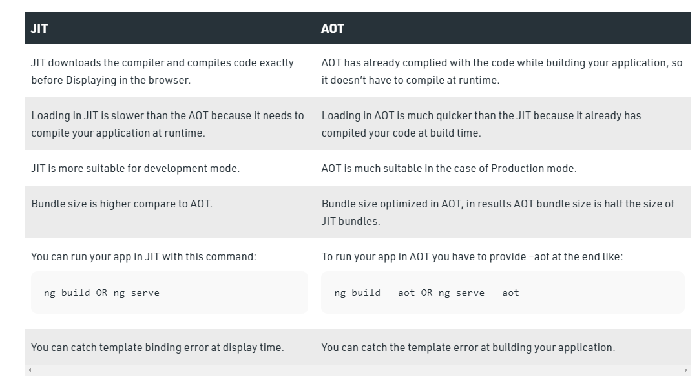

#JIT vs AOT
To ensure the fastest performance, JS engines use all kinds of tricks (like JITs, which lazy compile and even hot recompile)

AOT (ahead of time):
	Ahead of Time is a process of compiling higher-level language or intermediate 
	language into a native machine code, which is system dependent.

	In simple words, when you serve/build your angular application for example, the Ahead of Time compiler converts 
	your code during the build time before your browser downloads and runs that code. From Angular 9, 
	by default compiling option is set to true for ahead of time compiler.  

JIT (just in time):
	Just in time compiler, compiles code at runtime which means instead of interpreting byte code at build 
	time, it will compile byte code when that component is called.

