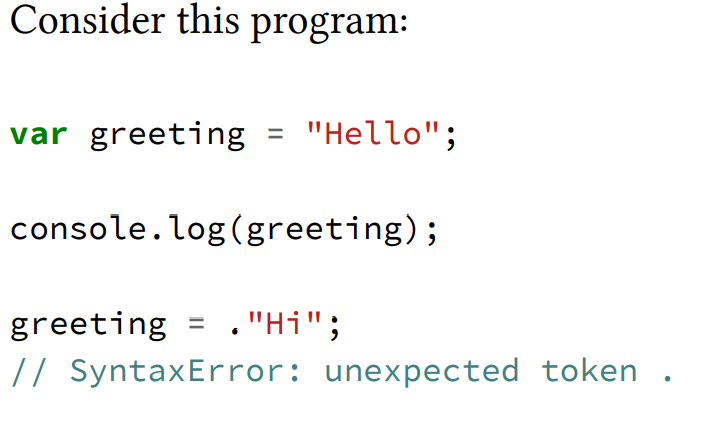

#Two phases of JS

the most important observation we can make about processing of JS programs is that it
occurs in (at least) two phases: parsing/compilation first, then execution.

There are three program characteristics you can observe to
prove this to yourself: syntax errors, early errors, and hoisting.

this generates a SyntaxError without printing anything.