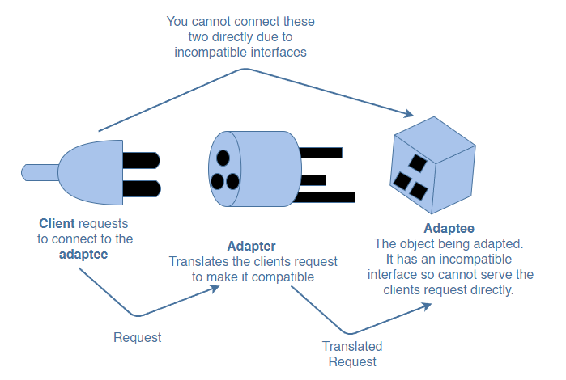

#What is the adapter pattern?

The adapter pattern allows those classes to work together that couldn’t because of having different interfaces (properties/methods of an object). It translates the interface for a class to make it compatible with another class.

This pattern is useful if an API is modified or new implementations are added to it. In this case, if the other parts of a system are still using the old API, the adapter pattern will translate the interface such that the two can work together.

As you can see from the diagram above, the client cannot connect to the adaptee, directly as the two interfaces are incompatible. This is where the adapter comes in. It translates the clients’ calls to its interface and redirects them into calls to the adaptee (original interface).