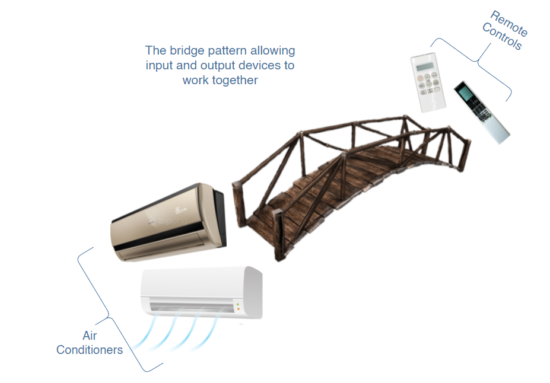

#What is the bridge pattern?

The bridge pattern allows separate components with separate interfaces to work together. It keeps an object’s interface separate from its implementation allowing the two to vary independently.

An example is of controlling an air conditioner with a remote. The air conditioners can be of different types, similarly, each of them is controlled by a different remote. The remotes can vary, that is, a new one with better features can be introduced but that won’t make any changes to the air conditioner classes. The same goes the other way around. Hence, the bridge pattern allows input and output devices to work together but vary independently.

