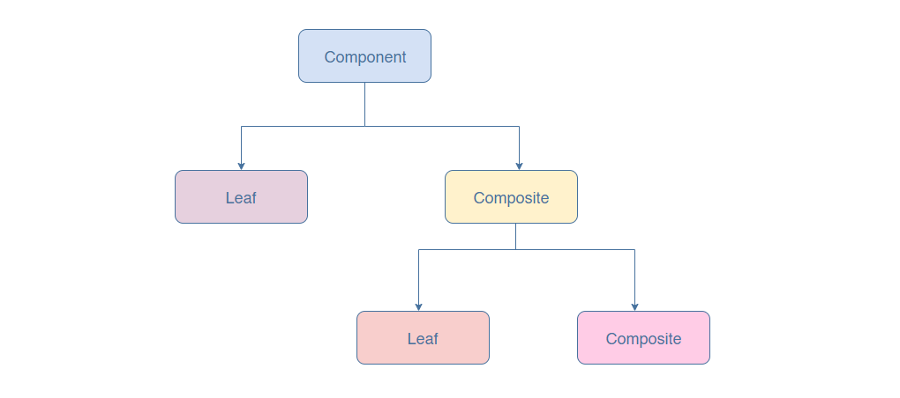

#What is the composite pattern?

The composite pattern is used to structure objects in a tree-like hierarchy. Here, each node of the tree can be composed of either child node(s) or be a leaf (no children objects). This pattern allows the client to work with these components uniformly; that is, a single object can be treated exactly how a group of objects is treated.

This pattern allows the formation of deeply nested structures. If a leaf object receives the request sent by the client, it will handle it. However, if the recipient is composed of children, the request is forwarded to the child components.

From the diagram you can see that a composite pattern consists of the following:

Component: an abstract class that contains methods such as add, remove, get that are used in managing the children. The component can be a leaf object or composite.

Composite: it is the subclass that implements component. It is composed of other components, that is, has children.

Leaf: it is the subclass that implements component. It does not have children.