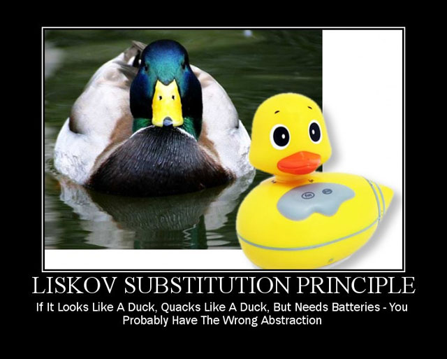

#Liskov Substitution Principle

A great example illustrating LSP was how sometimes something that sounds right in natural language doesn't quite work in code.

In mathematics, a Square is a Rectangle. Indeed it is a specialization of a rectangle. The "is a" makes you want to model this with inheritance. However if in code you made Square derive from Rectangle, then a Square should be usable anywhere you expect a Rectangle. This makes for some strange behavior.

Imagine you had SetWidth and SetHeight methods on your Rectangle base class; this seems perfectly logical. However if your Rectangle reference pointed to a Square, then SetWidth and SetHeight doesn't make sense because setting one would change the other to match it. In this case Square fails the Liskov Substitution Test with Rectangle and the abstraction of having Square inherit from Rectangle is a bad one.

