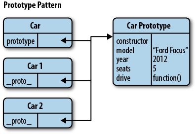

The GoF refers to the Prototype pattern as one that creates objects based on a template of an existing object through cloning.

We can think of the Prototype pattern as being based on prototypal inheritance in which we create objects that act as prototypes for other objects. The prototype object itself is effectively used as a blueprint for each object the constructor creates. If the prototype of the constructor function used contains a property called name for example, then each object created by that same constructor will also have this same property

Not only is the pattern an easy way to implement inheritance, but it can come with a performance boost as well: when defining functions in an object, they’re all created by reference (so all child objects point to the same function), instead of creating their own individual copies.