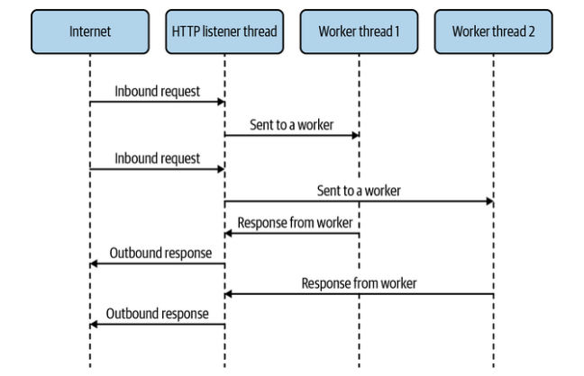
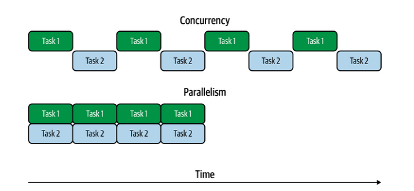

<div style='text-align: justify;'>

# Introduction
PCs in the 1980s typically had a single 8-bit CPU core and not a whole lot of memory. You typically could only run a single program at one time. What we think of these days as operating systems would not even be running at the same time as the program the user was interacting with.

Eventually, people wanted to run more than one program at once, and multitasking was born. This allowed operating
systems to run several programs at the same time by switching execution between them. Programs could decide when it would be an appropriate time to let another program run by yielding execution to the operating system. This approach is called cooperative multitasking.


In a cooperative multitasking environment, when a program fails to yield execution for any reason, no other program can continue executing. This interruption of other programs is not desirable, so eventually operating systems moved toward preemptive multitasking. In this model, the operating system would determine which program would run on the CPU at which time, using its own notion of scheduling, rather than relying on the programs themselves to be the sole deciders of when to switch execution. 

Before threads, a single program (that is, a single process) could not have multiple tasks running at the same time. Instead, programmers wishing to perform tasks concurrently would either have to split up the task into smaller chunks and schedule them inside the process or run separate tasks in separate processes and have them communicate with each other.

Even today, in some high-level languages the appropriate way to run multiple tasks at once is to run additional processes.


Until fairly recently, JavaScript was a language where the only multitasking mechanisms available were splitting tasks up and scheduling their pieces for later execution, and in the case of Node.js, running additional processes.

### A typical chunk of asynchronous JavaScript code, using two different patterns
```
  readFile(filename, (data) => {
    doSomethingWithData(data, (modifiedData) => {
      writeFile(modifiedData, () => {
        console.log('done');
      });
    });
  });
  // or
  const data = await readFile(filename);
  const modifiedData = await doSomethingWithData(data);
  await writeFile(filename);
  console.log('done');
```


threads are useful to JavaScript developers for cordoning off CPU-intensive tasks. In the browser, there are also special-purpose threads that have feature sets available to them that are different from the main thread.


### Spawning a browser thread

```
const worker = new Worker('worker.js');
worker.postMessage('Hello, world');
// worker.js
self.onmessage = (msg) => console.log(msg.data);
```

## What Are Threads?

In all modern operating systems, all units of execution outside the kernel are organized into processes and threads. Developers can use processes and threads, and communication between them, to add concurrency to a project. On systems with multiple CPU cores, this also means adding parallelism.

A program may spawn additional processes, which have their own memory space. These processes do not share memory (unless it’s mapped in via additional system calls) and have their own instruction pointers, meaning each one can be executing a different instruction at the same time. If the processes are being executed on the same core, the processor may switch back and forth between processes, temporarily stopping execution for that one process while another one executes.

A process may also spawn threads, rather than full-blown processes. A thread is just like a process, except that it shares memory space with the process that it belongs to. A process can have many threads, and each one has its own instruction pointer. All the same properties about execution of processes apply to threads as well. Because they share a memory space, it’s easy to share program code and other values between threads.


### Worker threads as they might be used in an HTTP serve
<div style='text-align:center'>


</div>
In order for threads to be useful, they need to be able to coordinate with each other. This means they have to be able to do things like wait for things to happen on other threads and get data from them.We have a shared memory space between threads, and with some other basic primitives, systems for passing messages between threads can be constructed. In many cases, these sorts of constructs are available at the language or platform level.


## Concurrency Versus Parallelism

    • Concurrency
      Tasks are run in overlapping time.
    • Parallelism
      Tasks are run at exactly the same time.

<div style='text-align:center'>


</div>

Here, we have two tasks running in parallel and concurrently. In the concurrent case, only one task is being executed at a given time, but throughout the entire period, execution switched between the two tasks. This means they’re running in overlapping time, so it fits the definition of concurrency. In the parallel case, both tasks are executing simultaneously, so they’re running in parallel. Since they’re also running in an overlapping time period, they’re also running concurrently. Parallelism is a subset of concurrency.

Threads do not automatically provide parallelism. The system hardware must allow for this by having multiple CPU cores, and the operating system scheduler must decide to run the threads on separate CPU cores. On single-core systems, or systems with more threads running than CPU cores, multiple threads may be run on a single CPU concurrently by switching between them at appropriate times. Also, in languages with a GIL like Ruby and Python, threads are explicitly prevented from offering parallelism because only one instruction can be executed at a time throughout the entire runtime.


It’s important to also think about this in terms of timing because threads are typically added to a program to increase performance. If your system is only allowing for concurrency due to only having a single CPU core available or being already loaded with other tasks, then there may not be any perceived benefit to using extra threads.


## Single-Threaded JavaScript
the platforms that JavaScript ran on did not provide any thread support, so the language was thought of as single-threaded. Whenever you hear someone say that JavaScript is single-threaded, they’re referring to this historical background and the programming style that it naturally lent itself to. It’s true that, despite the title of this book, the language itself does not have any built-in functionality to create threads. This shouldn’t be that much of a surprise because it also doesn’t have any built-in functionality to interact with the network, devices, or filesystem, or to make any system calls. Indeed, even such basics as setTimeout() aren’t actually JavaScript features. Instead environments the virtual machine (VM) is embedded in, such as Node.js or browsers, provide these via environment-specific APIs.

Instead of threads as a concurrency primitive, most JavaScript code is written in an event-oriented manner operating on a single execution thread. As various events like user interactions or I/O happen, they trigger the execution of functions previously set to run upon these events.

It’s often easy to think of operations happening in parallel, when in fact they’re happening concurrently. For example, imagine you want to open three files containing numbers, named 1.txt, 2.txt, and 3.txt, and then add up the results and print them. In Node.js, you might do something like
```
import fs from 'fs/promises';
async function getNum(filename) {
 return parseInt(await fs.readFile(filename, 'utf8'), 10);
}
try {
 const numberPromises = [1, 2, 3].map(i => getNum(`${i}.txt`));
 const numbers = await Promise.all(numberPromises);
 console.log(numbers[0] + numbers[1] + numbers[2]);
} catch (err) {
 console.error('Something went wrong:');
 console.error(err);
}

```

Since we’re using Promise.all(), we’re waiting for all three files to be read and parsed. However, just because the promises are being created together and waited upon together doesn’t mean that the code resolving them runs at the same time, it just means their time frames are overlapping. There’s still only one instruction pointer, and only one instruction is being executed at a time.

In the absence of threads, there’s only one JavaScript environment to work with. This means one instance of the VM, one instruction pointer, and one instance of the garbage collector. By one instruction pointer, we mean that the JavaScript interpreter is only executing one instruction at any given time. That doesn’t mean we’re restricted to one global object though. In both the browser and Node.js, we have realms at our disposal.

** Note: Realms can be thought of as instances of the JavaScript environment as provided to JavaScript code. This means that each realm gets its own global object, and all of the associated properties of the global object, such as built-in classes like Date and other objects like Math. The global object is referred to as global in Node.js and window in browsers, but in modern versions of both, you can refer to the global object as globalThis. **


In browsers, each frame in a web page has a realm for all of the JavaScript within it. Because each frame has its own copy of Object and other primitives within it, you’ll notice that they have their own inheritance trees, and instanceof might not work as you expect it to when operating on objects from different realms.


### Objects from a different frame in a browser
```
const iframe = document.createElement('iframe');
document.body.appendChild(iframe);
const FrameObject = iframe.contentWindow.Object; // 1
console.log(Object === FrameObject); // 2
console.log(new Object() instanceof FrameObject); // 3
console.log(FrameObject.name);  // 4

```

    1 - The global object inside the iframe is accessible with the contentWindow property.
    2 - This returns false, so the Object inside the frame is not the same as in the main frame.
    3 - instanceof evaluates to false, as expected since they’re not the same Object.
    4 - Despite all this, the constructors have the same name property

### Objects from a new Context in Node.js
```
const vm = require('vm');
const ContextObject = vm.runInNewContext('Object'); //1
console.log(Object === ContextObject); //2
console.log(new Object() instanceof ContextObject); //3
console.log(ContextObject.name); //4
```

    1 - We can get objects from a new context using runInNewContext.
    2 - This returns false, so as with browser iframes, Object inside the context is not the same as in the main context.
    3 - Similarly, instanceof evaluates to false.
    4 - Once again, the constructors have the same name property.


In Node.js, realms can be constructed with the vm.createContext() function. In Node.js parlance, realms are called Contexts. All the same rules and properties applying to browser frames also apply to Contexts, but in Contexts, you don’t have access to any global properties or anything else that might be in scope in your Node.js files. If you want to use these features, they need to be manually passed in to the Context.


## Hidden Threads

While your JavaScript code may run, at least by default, in a single-threaded environment, that doesn’t mean the process running your code is single-threaded. In fact, many threads might be used to have that code running smoothly and efficiently. It’s a common misconception that Node.js is a single-threaded process.


Modern JavaScript engines like V8 use separate threads to handle garbage collection and other features that don’t need to happen in line with JavaScript execution. In addition, the platform runtimes themselves may use additional threads to provide other features.

In Node.js, libuv is used as an OS-independent asynchronous I/O interface, and since not all systemprovided I/O interfaces are asynchronous, it uses a pool of worker threads to avoid blocking program code when using otherwise-blocking APIs, such as filesystem APIs. By default, four of these threads are spawned, though this number is configurable via the UV_THREADPOOL_SIZE environment variable, and can be up to 1,024.

<div style='text-align: center'>


</div>


A simple Node.js web server was started, and the PID was noted and passed to top. You can see the various V8 and libuv threads add up to seven threads, including the one that the JavaScript code runs in. You can try this with your own Node.js programs, and even try changing the UV_THREADPOOL_SIZE environment variable to see the number of threads change.

Browsers similarly perform many tasks, such as Document Object Model (DOM) rendering, in threads other than the one used for JavaScript execution. An experiment with top -H like we did for Node.js would result in a similar handful of threads. Modern browsers take this even further by using multiple processes to add a layer of security by isolation.

</div>