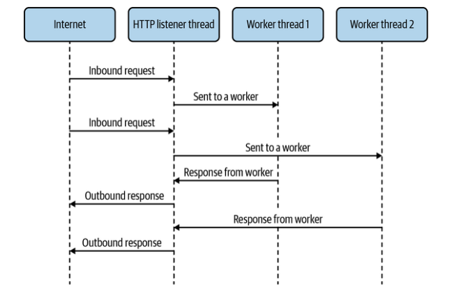

# Node.js

## Before We Had Threads
Prior to threads being available in Node.js, if you wanted to take advantage of CPU cores, you needed to use processes. But we don’t get some of the benefits we’d get from threads if we use processes. That being said, if shared memory isn’t important (and in many cases it isn’t!) then processes are perfectly able to solve these kinds of problems for you.

Consider:
<div style='text-align:center'>

  

</div>

In the previous scenario, we have threads responding to HTTP requests sent to them from a main thread, which is listening on a port. While this concept is great for handling traffic from several CPU cores, we can also use processes to achieve a similar effect.


<div style='text-align:center'>


</div>


Although we could do something like this using the child_process API in Node.js, we’re better off using cluster, which was purpose-built for this use case.

### A “Hello, World” server in Node.js

```
const http = require('http');
http.createServer((req, res) => {
 res.end('Hello, World!\n');
}).listen(3000);
```

With the cluster module, the common approach is to use an if block to detect whether we’re in the main listening process or one of the worker processes. If we’re in the main process, then we have to do the work of spawning the worker processes. Otherwise, we just set up an ordinary web server as before in each of the workers.


### A “Hello, World” server in Node.js using cluster

```
const http = require('http');
const cluster = require('cluster'); // 1
if (cluster.isPrimary) { // 2
 cluster.fork(); // 3
 cluster.fork();
 cluster.fork();
 cluster.fork();
} else {
 http.createServer((req, res) => {
 res.end('Hello, World!\n');
 }).listen(3000); // 4
}
```
    1 - Require the cluster module.
    2 - Change code paths depending on whether we’re in the primary process.
    3 - In the primary process, create four worker processes.
    4 - In the worker processes, create a web server and listen, like in Processes example image.


You may notice that we’re creating web servers that listen on the same port in four difference processes. It seems like a mistake. After all, if we try to bind a server to a port that’s already being used, we usually get an error. Don’t worry! We’re not actually listening on the same port four times. It turns out Node.js does some magic for us in cluster.

When worker processes are set up in a cluster, any call to listen() will actually cause Node.js to listen on the primary process rather than on the worker. Then, once a connection is received in the primary process, it’s handed off to a worker process via IPC. On most systems, this happens on a round-robin basis. This somewhat convoluted system is how each worker can appear to be listening on the same port, when in fact it’s just the primary process listening on that port and passing connections off to all the workers.

Processes incur some extra overhead that threads don’t, and we also don’t get shared memory, which helps with faster transfer of data. For that, we need the worker_threads module.

## The worker_threads Module
Node.js’s support for threads is in a built-in module called worker_threads. It provides an interface to threads that mimics a lot of what you’d find in web browsers for web workers. Since Node.js is not a web browser, not all the APIs are the same, and the environment inside these worker threads isn’t the same as what you’d find inside web workers.


Instead, inside Node.js worker threads you’ll find the usual Node.js API available via require, or import if you’re using ESM. There are a few differences in the API compared to the main thread though:

    • You can’t exit the program with process.exit(). Instead this will just exit the thread.
    • You can’t change working directories with process.chdir(). In fact, this function is not even available.
    • You can’t handle signals with process.on().


Another important thing to note is that the libuv worker pool is shared across worker threads. Recall “Hidden Threads”, where it was noted that the libuv thread pool consists of a default of four threads to create nonblocking interfaces to low-level blocking APIs.

If you’re finding yourself bound by that thread pool’s size (due to, for example, a lot of filesystem I/O), you’ll find that adding more threads via worker_threads won’t lighten the load. Instead, apart from considering various caching solutions and other optimizations, consider increasing your UV_THREADPOOL_SIZE. Likewise, you might find that you have little choice but to increase this when adding JavaScript threads via the worker_threads module, due to their usage of the libuv thread pool.


You can create a new worker thread by using the Worker constructor:
```
const { Worker } = require('worker_threads');
const worker = new Worker('/path/to/worker-file-name.js'); // 1
```


    1 - The filename here is the entrypoint file that we want to run inside the worker thread. 
      This is similar to the entrypoint in the main file that we’d specify as an argument to node on the command line.


##### workerData

It’s not sufficient to just be able to create a worker thread. We need to interact with it! The Worker constructor takes a second argument, an options object, that among other things allows us to specify a set of data to be passed immediately to the worker thread. The options object property is called workerData, and its contents will be copied into the worker thread via the means described in the Appendix. Inside the thread, we can access the cloned data via the workerData property of the worker_threads module.


###  Passing data to a worker thread via workerData
```
const {
 Worker,
 isMainThread,
 workerData
} = require('worker_threads');
const assert = require('assert');
if (isMainThread) { // 1
 const worker = new Worker(__filename, { workerData: { num: 42 }
});
} else {
 assert.strictEqual(workerData.num, 42);
}
```

    Rather than using a separate file for the worker thread, we can use the current file with __filename and switch
    the behavior based on isMainThread.

It’s important to note that the properties of the workerData object are cloned rather than shared between threads. Unlike in C, shared memory in JavaScript threads does not thread. They are separate objects.

That being said, you can have memory that’s shared between threads via SharedArrayBuffer. These can be shared via workerData or by being sent through a MessagePort.

##### MessagePort

A MessagePort is one end of a two-way data stream. By default, one is provided to every worker thread to provide a communication channel to and from the main thread. It’s available in the worker thread as the parentPort property of the worker_threads module.

To send a message via the port, the postMesage() method is called on it. The first argument is any object that can be passed, which will end up being the message data being passed to the other end of the port. When a message is received on the port, the message event is fired, with the message data being the first argument to the event handler function. In the main thread, the event and the postMessage() method are on the worker instance itself, rather than having to get them from a MessagePort instance. 

### Bidirectional communication via the default MessagePorts
```
const {
 Worker,
 isMainThread,
 parentPort
} = require('worker_threads');
if (isMainThread) {
 const worker = new Worker(__filename);
 worker.on('message', msg => {
 worker.postMessage(msg);
 });
} else {
 parentPort.on('message', msg => {
 console.log('We got a message from the main thread:', msg);
 });
 parentPort.postMessage('Hello, World!');
}

```

You can also create a pair of MessagePort instances connected to each other via the MessageChannel constructor. You can then pass one of the ports via an existing message port (like the default one) or via workerData. You might want to do this in situations where neither of two threads that need to communicate are the main thread, or even just for organizational purposes. the next code is the same as the previous example, except using ports created via MessageChannel and passed via workerData.

### Bidirectional communication via MessagePort created with MessageChannel

```
const {
 Worker,
 isMainThread,
 MessageChannel,
 workerData
} = require('worker_threads');
if (isMainThread) {
 const { port1, port2 } = new MessageChannel();
 const worker = new Worker(__filename, {
 workerData: {
 port: port2
 },
 transferList: [port2]
 });
 port1.on('message', msg => {
 port1.postMessage(msg);
 });
} else {
 const { port } = workerData;
 port.on('message', msg => {
 console.log('We got a message from the main thread:', msg);
 });
 port.postMessage('Hello, World!');
}
```

You’ll notice we used the transferList option when instantiating the Worker. This is a way of transferring ownership of objects from one thread to another. This is required when sending any MessagePort, ArrayBuffer, or FileHandle objects via workerData or postMessage. Once these objects are transferred, they can no longer be used on the sending side.


## Worker Pools with Piscina

Many types of workloads will naturally lend themselves to using threads. In Node.js, most workloads involve processing an HTTP request. If within that code you find yourself doing a lot of math or synchronous data processing, it may make sense to offload that work to one or more threads. These types of operations involve submitting a single task to a thread and waiting for a result from it. In much the same way a threaded web server often works, it makes sense to maintain a pool of workers that can be sent various tasks from the main thread.


    ** NOTE **
    The concept of pooled resources isn’t unique to threads. For example, web browsers typically create pools of socket 
    connections to web servers so that they can multiplex all the various HTTP requests required to render a web page across
    those connections. Database client libraries often do a similar thing with sockets connected to the database server. 

    There’s a handy module available for Node.js called generic-pool, which is a helper module for dealing with arbitrary
    pooled resources. These resources could be anything, like database connections, other sockets, local caches, threads,
    or pretty much anything else that might require having multiple instances of something but only accessing one at a time,
    without caring which one it is.


For the use case of discrete tasks sent to a pool of worker threads, we have the piscina module at our disposal. This module encapsulates the work of setting up a bunch of worker threads and allocating tasks to them. The name of the module comes from the Italian word for “pool.”

The basic usage is straightforward. You create an instance of the Piscina class, passing in a filename, which will be used in the worker thread. Behind the scenes, a pool of worker threads is created, and a queue is set up to handle incoming tasks. You can enqueue a task by calling .run(), passing in a value containing all the data necessary to complete this task, and noting that the values will be cloned as they would be with postMessage(). This returns a promise that resolves once the tasks have been completed by a worker, giving a result value. In the file to be run in the worker, a function must be exported that takes in whatever is passed to .run() and returns the result value. This function can also be an async function, so that you can do asynchronous tasks in a worker thread if you need to.

### Computing square roots with piscina

```
const Piscina = require('piscina');
if (!Piscina.isWorkerThread) { // 1
 const piscina = new Piscina({ filename: __filename }); // 2
 piscina.run(9).then(squareRootOfNine => { // 3
 console.log('The square root of nine is', squareRootOfNine);
 });
}
module.exports = num => Math.sqrt(num); // 4
```

    1 - Much like cluster and worker_threads, piscina provides a handy boolean for determining whether we’re in the main thread or a worker thread.

    2 - We’ll use the same technique for using the same file as we did with the Happycoin example. 

    3 - Since .run() returns a promise, we can just call .then() on it.

    4 - The exported function is used in the worker thread to perform the actual work. In this case, it’s just calculating a square root.


While it’s all fine and good to run one task on the pool, we need to be able to run many tasks on the pool.

###  Computing ten million square roots with piscina

```
const Piscina = require('piscina');
const assert = require('assert');
if (!Piscina.isWorkerThread) {
 const piscina = new Piscina({ filename: __filename });
 for (let i = 0; i < 10_000_000; i++) {
 piscina.run(i).then(squareRootOfI => {
 assert.ok(typeof squareRootOfI === 'number');
 });
 }
}
module.exports = num => Math.sqrt(num);
```


This seems like it ought to work. We’re submitting ten million numbers to be processed by the worker pool. However, if you run this code, you’ll get a nonrecoverable JavaScript memory allocation error. On one trial of this with Node.js v16.0.0, the following output was observed.
```
FATAL ERROR: Reached heap limit Allocation failed
 - JavaScript heap out of memory
 1: 0xb12b00 node::Abort() [node]
 2: 0xa2fe25 node::FatalError(char const*, char const*) [node]
 3: 0xcf8a9e v8::Utils::ReportOOMFailure(v8::internal::Isolate*,
 char const*, bool) [node]
 4: 0xcf8e17
v8::internal::V8::FatalProcessOutOfMemory(v8::internal::Isolate*,
 char const*, bool) [node]
 5: 0xee2d65 [node]
[ ... 13 more lines of a not-particularly-useful C++ stacktrace
... ]
Aborted (core dumped)

```


It turns out the underlying task queue is not infinite. By default, the task queue will keep growing and growing until we run into an allocation error like this one. To avoid having this happen, we need to set a reasonable limit. The piscina module lets you set a limit by using a maxQueue option in its constructor, which can be set to any positive integer. Through experimentation, the maintainers of piscina have found that an ideal maxQueue value is the square of the number of worker threads it’s using. Handily, you can use this number without even knowing it by setting maxQueue to auto.

Once we’ve established a bound for the queue size, we need to be able to handle it when the queue is full. There are two ways to detect that the queue is full:


    1. Compare the values of piscina.queueSize and
        piscina.options.maxQueue. If they’re equal, then
        the queue is full. This can be done prior to calling
        piscina.run() to avoid attempting to enqueue
        when it’s full. This is the recommended way to
        check.

    2. If piscina.run() is called when the queue is full,
        the returned promise will reject with an error
        indicating that the queue is full. This isn’t ideal
        because by this point we’re already in a further tick
        of the event loop and many other attempts to
        enqueue may already have happened.


When we know that the queue is full, we need a way of knowing when it’ll be ready for new tasks again. Fortunately, piscina pools emit a drain event once the queue is empty, which is certainly an ideal time to start adding new tasks.

### Computing ten million square roots with piscina, without crashing

```
const Piscina = require('piscina');
const assert = require('assert');
const { once } = require('events');
if (!Piscina.isWorkerThread) {
 const piscina = new Piscina({
 filename: __filename,
 maxQueue: 'auto' // 1
 });
 (async () => { // 2
 for (let i = 0; i < 10_000_000; i++) {
 if (piscina.queueSize === piscina.options.maxQueue) { // 3 
 await once(piscina, 'drain'); // 4 
 }
 piscina.run(i).then(squareRootOfI => {
 assert.ok(typeof squareRootOfI === 'number');
 });
 }
 })();
}

module.exports = num => Math.sqrt(num);

```

    1 - The maxQueue option is set to auto, which limits the
        queue size to the square of the number of threads that
        piscina is using.

    2 - The for loop is wrapped in an async immediately
        invoked function expression (IIFE) in order to use an
        await within it.

    3 - When this check is true, the queue is full.

    4 - We then wait for the drain event before submitting any
        new tasks to the queue.


Running this code does not result in an out-of-memory crash like it did before. It takes a fairly long time to complete, it does finally exit without issue.

As seen here, it’s easy to fall into a trap where using a tool in what seems like the most sensible way isn’t the best approach. It’s important to fully understand tools like piscina when building out your multithreaded applications.