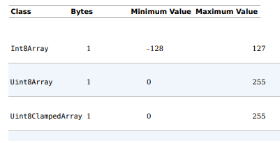
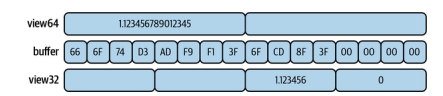
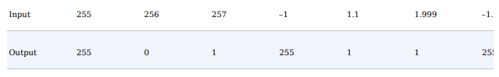
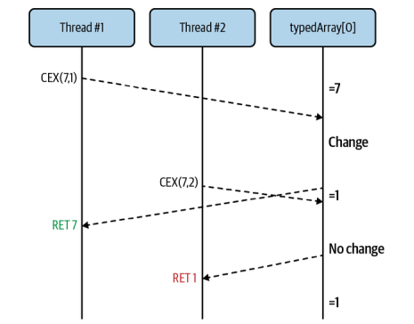
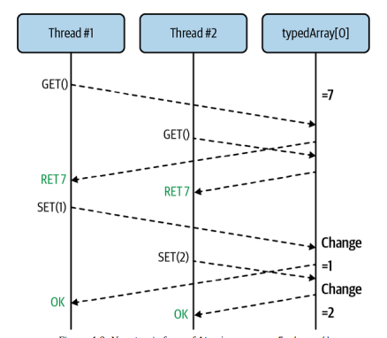

## Intro to Shared Memory

### Shared Memory in the Browser
##### ch4-web-workers/index.html
```
<html>
 <head>
 <title>Shared Memory Hello World</title>
 <script src="main.js"></script>
 </head>
</html>

```

##### ch4-web-workers/main.js

```
if (!crossOriginIsolated) { // 1
 throw new Error('Cannot use SharedArrayBuffer');
}
const worker = new Worker('worker.js');
const buffer = new SharedArrayBuffer(1024); // 2
const view = new Uint8Array(buffer); // 3
console.log('now', view[0]);
worker.postMessage(buffer);
setTimeout(() => {
 console.log('later', view[0]);
 console.log('prop', buffer.foo); // 4
}, 500);
```

    1 - When crossOriginIsolated is true, then SharedArrayBuffer can be used.
    2 - Instantiates a 1 KB buffer.
    3 - A view into the buffer is created.
    4 - A modified property is read.

New thing from the previous files created before, is the check for the crossOriginIsolated value, which is a global variable available in modern browsers. This value tells you if the JavaScript code currently being  run is capable of, among other things, instantiating a SharedArrayBuffer instance.


For security reasons (related to the Spectre CPU attack), the SharedArrayBuffer object isn’t always available for instantiation. In fact, a few years ago browsers disabled this functionality entirely. Now, both Chrome and Firefox support the object and require additional HTTP headers to be set when the document is served before it will allow a SharedArrayBuffer to be instantiated. Node.js doesn’t have the same restrictions.


Here are the required headers:
    Cross-Origin-Opener-Policy: same-origin
    Cross-Origin-Embedder-Policy: require-corp


    ** NOTE **
    The test server that you’ll run automatically sets these headers. Any time you build a
    production-ready application that uses SharedArrayBuffer instances you’ll need to
    remember to set these headers.


After a dedicated worker is instantiated, an instance of a SharedArrayBuffer is also instantiated. The argument that follows, 1,024 in this case, is the number of bytes allocated to the buffer.

This view into the buffer allows us to read from it using the array index syntax. In this case, we’re able to inspect the 0th byte in the buffer by logging a call to view[0]. After that, the buffer instance is passed into the worker using the worker.postMessage() method. In this case the buffer is the only thing being passed in. However, a more complex object could have been passed in as well, with the buffer being one of the properties. Instances of SharedArrayBuffer are an intentional exception.


Once the script is finished with the setup work, it schedules a function to run in 500 ms. This script prints the 0th byte of the buffer again and also attempts to print a property attached to the buffer named .foo. Note that this file otherwise does not have a worker.onmessage handler defined.

##### ch4-web-workers/worker.js
```
self.onmessage = ({data: buffer}) => {
 buffer.foo = 42; // 1
 const view = new Uint8Array(buffer);
 view[0] = 2; // 2
 console.log('updated in worker');
};

```

    1 - A property on the buffer object is written.
    2 - The 0th index is set to the number 2.

This file attaches a handler for the onmessage event, which is run after the .postMessage() method in main.js is fired. Once called, the buffer argument is grabbed. The first thing that happens in the handler is that a .foo property is attached to the SharedArrayBuffer instance. Next, another view is created for the buffer. After that the buffer is updated through the view. Once that’s done, a message is printed so that you can see what has happened.

After we run the whole code, The first printed line is the initial value of the buffer as seen in main.js. In this case the value is 0. Next, the code in worker.js is run, though the timing of this is mostly indeterminate. About half a second later, the value as perceived in main.js is printed again, and the value is now set to 2. Again, notice that other than the initial setup work, no message passing happened between the thread running the main.js file and the thread running the worker.js file.

After the buffer value is printed, the .foo property is also printed and a value of undefined is displayed. Why might this be? Well, while it’s true that a reference to the memory location that stores the binary data contained in the buffer has been shared between the two JavaScript environments, the actual object itself has not been shared. If it had been, this would violate the constraint of the structured clone algorithm wherein object references cannot be shared between threads.


### Shared Memory in Node.js

The Node.js equivalent of this application is mostly similar; however, the Worker global provided by browsers isn’t available, and the worker thread won’t make use of self.onmessage. Instead, the worker threads module must be required to gain access to this functionality. Since Node.js isn’t a browser the index.html file isn’t applicable.


#### ch4-web-workers/main-node.js

```
const { Worker } = require('worker_threads');
const worker = new Worker(__dirname + '/worker-node.js');
const buffer = new SharedArrayBuffer(1024);
const view = new Uint8Array(buffer);
console.log('now', view[0]);
worker.postMessage(buffer);
setTimeout(() => {
 console.log('later', view[0]);
 console.log('prop', buffer.foo);
 worker.unref();
}, 500);
```

The code is a little different, but it should feel mostly familiar. Because the Worker global isn’t available, it is instead accessed by pulling the .Worker property from the required worker_threads module. When instantiating the worker a more explicit path to the worker must be provided than what is accepted by browsers. In this case the path ./worker-node.js was required, even though browsers are fine with just worker.js. Other than that, the main JavaScript file for this Node.js example is mostly unchanged when compared to the browser equivalent. The final worker.unref() call was added to prevent the worker from keeping the process running forever.

#### ch4-web-workers/worker-node.js

```
const { parentPort } = require('worker_threads');
parentPort.on('message', (buffer) => {
 buffer.foo = 42;
 const view = new Uint8Array(buffer);
 view[0] = 2;
 console.log('updated in worker');
});
```

In this case the self.onmessage value isn’t available to the worker. Instead, the worker_threads module is required again, and the .parentPort property from the module is used. This is used to represent a connection to the port from the calling JavaScript environment.

The .onmessage handler can be assigned to the parentPort object, and the method .on('message', cb) can be called. If using both, they’ll be called in the order that they were used. The callback function for the message event receives the object being passed in (buffer in this case) directly as an argument, while the onmessage handler provides a MessageEvent instance with a .data property containing buffer. Which approach you use mostly depends on personal preference.

Other than that the code is exactly the same between Node.js and the browser, the same applicable globals like SharedArrayBuffer are still available, and they still work the same for the sake of this example.


## SharedArrayBuffer and TypedArrays

Traditionally the JavaScript language didn’t really support interaction with binary data. Sure, there were strings, but they really abstracted the underlying data storage mechanism. There were also arrays, but those can contain values of any type and aren’t appropriate for representing binary buffers. For many years that was sort of “good enough,” especially before the advent of Node.js and the popularity of running JavaScript outside of a web page context took off.

The Node.js runtime is, among other things, capable of reading and writing to the filesystem, streaming data to and from the network, and so on. Such interactions are not only limited to ASCII-based text files but can also include piping binary data as well. Since there wasn’t a convenient buffer data structure available, the authors created their own. Thus, the Node.js Buffer was born.


As the boundaries of the JavaScript language itself were pushed, so too grew the APIs and the capabilities of the language to interact with the world outside of the browser window. Eventually the ArrayBuffer object and later the SharedArrayBuffer object were created and are now a core part of the language. Most likely, if Node.js were created today, it would not have created its own Buffer implementation.

The term view has been mentioned in a few places, and now is a good time to define it. Due to the ambiguity of what binary data can mean, we need to use a view to read and write to the underlying buffer. There are several of these views available in JavaScript. Each of these views extends from a base class called TypedArray. This class can’t be instantiated directly and isn’t available as a global, but it can be accessed by grabbing the .prototype property from an instantiated child class.

####  list of the view classes that extend from TypedArray.




The Class column is the name of the class that is available for instantiation. These classes are globals and are accessible in any modern JavaScript engine. The Bytes column is the number of bytes that are used to represent each individual element in the view. The Minimum Value and Maximum Value columns display the valid numeric ranges that can be used to represent an element in the buffer.

When creating one of these views, the ArrayBuffer instance is passed into the constructor of the view. The buffer byte length must be a multiple of the element byte length used by the particular view that it’s being passed into. For example, if an ArrayBuffer composed of 6 bytes were created, it is acceptable to pass that into an Int16Array (byte length of 2) because this will represent three Int16 elements. However, the same 6-byte buffer cannot be passed into an Int32Array because it would represent one and a half elements, which isn’t valid.

The U prefix to half of these classes refers to unsigned, which means that only positive numbers may be represented. Classes without the U prefix are signed and so negative and positive numbers may be represented, though with only half the maximum value. This is because a signed number uses the first bit to represent the “sign,” conveying if the number is positive or negative.

The numeric range limitations come from the amount of data that can be stored in a single byte to uniquely identify a number. Much like with decimal, numbers are counted from zero on up to the base, and then roll over to a number on the left. So, for a Uint8 number, or an “unsigned integer represented by 8 bits,” the maximum value (0b11111111) is equal to 255.

JavaScript doesn’t have an integer data type, only its Number type, which is an implementation of the IEEE 754 floating-point number. It is equivalent to the Float64 data type. Otherwise, any time a JavaScript Number is written to one of these views, some sort of conversion process needs to happen.


When a value is written to Float64Array, it can be left mostly as the same. The minimum allowed value is the same as Number.MIN_VALUE, while the maximum is Number.MAX_VALUE. When a value is written to a Float32Array, not only are the minimum and maximum value ranges reduced but the decimal precision will be truncated as well.

```
const buffer = new ArrayBuffer(16);
const view64 = new Float64Array(buffer);
view64[0] = 1.1234567890123456789; // bytes 0 - 7
console.log(view64[0]); // 1.1234567890123457
const view32 = new Float32Array(buffer);
view32[2] = 1.1234567890123456789; // bytes 8 - 11
console.log(view32[2]); // 1.1234568357467651
```
In this case, the decimal precision for the float64 number is accurate to the 15th decimal, while the precision for the float32 number is only accurate to the 6th decimal.

In this case, the decimal precision for the float64 number is accurate to the 15th decimal, while the precision for the float32 number is only accurate to the 6th decimal. This code exemplifies another thing of interest. In this case, there is a single ArrayBuffer instance named buffer, and yet there are two different TypedArray instances that point to this buffer data. Can you think of what’s weird with this?



What do you think will be returned if you were to read either view64[1], view32[0], or view32[1]? In this case, a truncated version of the memory used to store data of one type will be combined, or split, to represent data of another type. The values returned are interpreted in the wrong way and are nonsensical, though they should be deterministic and consistent.

When numeric values that are outside of the range of the supported TypedArray for nonfloats are written, they need to go through some sort of conversion process to fit the target data type. First, the number must be converted into an integer, as if it were passed into Math.trunc(). If the value falls outside of the acceptable range, then it wraps around and resets at 0 as if using the modulus (%) operator. Here are some examples of this happening with a Uint8Array (which is a TypedArray with a max element value of 255):

```
const buffer = new ArrayBuffer(8);
const view = new Uint8Array(buffer);
view[0] = 255; view[1] = 256;
view[2] = 257; view[3] = -1;
view[4] = 1.1; view[5] = 1.999;
view[6] = -1.1; view[7] = -1.9;
console.log(view);
```

the next table contains a list of the values output on the second line, with their correlating values on the first line.



This behavior is a little different for Uint8ClampedArray. When a negative value is written, it is converted into 0. When a value greater than 255 is written, it’s converted into 255. When a noninteger value is provided, it’s instead passed to Math.round(). Depending on your use case, it may make more sense to use this view.

Finally, the BigInt64Array and BigUint64Array entries also deserve some special attention. Unlike the other TypedArray views, which work with the Number type, these two variants work with the BigInt type (1 is a Number while 1n is a BigInt). This is because the numeric values that can be represented using 64 bytes fall out of the range of the numbers than can be represented using JavaScript’s Number. For that reason, setting a value with these views must be done with a BigInt, and the values retrieved will also be of type BigInt.

In general, using multiple TypedArray views, especially those of different sizes, to look into the same buffer instance is a dangerous thing and should be avoided when possible. You might find that you accidentally clobber some data when performing different operations. It is possible to pass more than one SharedArrayBuffer between threads, so if you find yourself needing to mix types, then you might benefit from having more than one buffer.


## Atomic Methods for Data Manipulation

Atomicity is a term that you might have heard before, particularly when it comes to databases, where it’s the first word in the acronym ACID (atomicity, consistency, isolation, durability). Essentially, if an operation is atomic, it means that while the overall operation may be composed of multiple smaller steps, the overall operation is guaranteed to either entirely succeed or entirely fail. For example, a single query sent to a database is going to be atomic, but three separate queries aren’t atomic.

If those three queries are wrapped in a database transaction, then the whole lot becomes atomic; either all three queries run successfully, or none run successfully. It’s also important that the operations are executed in a particular order, assuming they manipulate the same state or otherwise have any side effects than can affect each other. The isolation part means that other operations can’t run in the middle; for example, a read can’t occur when only some of the operations have been applied.


Atomic operations are very important in computing, especially when it comes to distributed computing. Databases, which may have many client connections, need to support atomic operations. Distributed systems, where many nodes on a network communicate, also need to support atomic operations. Extrapolating that idea a little, even within a single computer where data access is shared across multiple threads, atomicity is important

JavaScript provides a global object named Atomics with several static methods available on it. This global follows the same pattern as the familiar Math global. In either case you can’t use the new operator to create a new instance, and the available methods are stateless, not affecting the global itself. Instead, with Atomics, they’re used by passing in a reference to the data that is to be modified.

##### Atomics.add() 
` old = Atomics.add(typedArray, index, value) `

This method adds the provided value to the existing value in a typedArray that is located at index. The old value is returned. Here’s what the nonatomic version might look like:

```
const old = typedArray[index];
typedArray[index] = old + value;
return old;
```

##### Atomics.and()
`old = Atomics.and(typedArray, index, value)`
This method performs a bitwise and using value with the existing value in typedArray located at index. The old value is returned. Here’s what the nonatomic version might look like:

```
const old = typedArray[index];
typedArray[index] = old & value;
return old;
```

##### Atomics.compareExchange()
`old = Atomics.compareExchange(typedArray, index, oldExpectedValue, value)`

This method checks typedArray to see if the value oldExpectedValue is located at index. If it is, then the value is replaced with value. If not, then nothing happens. The old value is always returned, so you can tell if the exchange succeeded if oldExpectedValue === old. Here’s what the nonatomic version might look like:

```
const old = typedArray[index];
if (old === oldExpectedValue) {
 typedArray[index] = value;
}
return old;
```

##### Atomics.exchange()
` old = Atomics.exchange(typedArray, index, value)`

This method sets the value in typedArray located at index to value. The old value is returned. Here’s what the nonatomic version might look like:

```
const old = typedArray[index];
typedArray[index] = value;
return old;
```

##### Atomics.isLockFree()
`free = Atomics.isLockFree(size)`

This method returns a true if size is a value that appears as the BYTES_PER_ELEMENT for any of the TypedArray subclasses (usually 1, 2, 4, 8), and a false if otherwise. If true, then using the Atomics methods will be quite fast using the current system’s hardware. If false, then the application might want to use a manual locking mechanism, like what is covered in “Mutex: A Basic Lock”, especially if performance is the main concern.


##### Atomics.load()
`value = Atomics.load(typedArray, index)`

This method returns the value in typedArray located at index. Here’s what the nonatomic version might look like:

```
const old = typedArray[index];
return old;
```

##### Atomics.or()
`old = Atomics.or(typedArray, index, value)`
This method performs a bitwise or using value with the existing value in typedArray located at index. The old value is returned. Here’s what the nonatomic version might look like:

##### Atomics.store()
`value = Atomics.store(typedArray, index, value)`

This method stores the provided value in typedArray located at index. The value that was passed in is then returned. Here’s what the nonatomic version might look like: 

```
typedArray[index] = value;
return value;
```

##### Atomics.sub()
`old = Atomics.sub(typedArray, index, value)`

This method subtracts the provided value from the existing value in typedArray that is located at index. The old value is returned. Here’s what the nonatomic version might look like:

```
const old = typedArray[index];
typedArray[index] = old - value;
return old;
```

##### Atomics.xor()
`old = Atomics.xor(typedArray, index, value)`

This method performs a bitwise xor using value with the existing value in typedArray located at index. The old value is returned. Here’s what the nonatomic version might look like:

```
const old = typedArray[index];
typedArray[index] = old ^ value;
return old;
```


## Atomicity Concerns
The methods covered in “Atomic Methods for Data Manipulation” are each guaranteed to execute atomically. For example, consider the Atomics.compareExchange() method. This method takes an oldExpectedValue and a new value, replacing the existing value only if it equals oldExpectedValue with the new value. While this operation would take several individual statements to represent with JavaScript, it’s guaranteed that the overall operation will always execute entirely.


To illustrate this, imagine you have a Uint8Array named typedArray, and the 0th element is set to 7. Then, imagine that multiple threads have access to that same typedArray, and each of them executes some variant of the following line of code:

```
let old1 = Atomics.compareExchange(typedArray, 0, 7, 1); // Thread #1
let old2 = Atomics.compareExchange(typedArray, 0, 7, 2); // Thread #2
```

It’s entirely nondeterministic the order that these three methods are called in, or even the timing of their calls. In fact, they could be called simultaneously! However, with the atomicity guarantee of the Atomics object, it’s guaranteed that exactly one of the threads will have the initial 7 value returned, while the other thread will get the updated value of 1 or 2 returned. A timeline of how these operations work can be seen in the next image, with the CEX(oldExpectedValue, value) being a shorthand for Atomics.compareExchange().




On the other hand, if you’re using the nonatomic equivalent of compareExchange(), such as reading and writing to typedArray[0] directly, it is entirely possible that the program will accidentally clobber a value. In this case both threads read the existing value at about the same time, then they both see that the original value is present, then they both write at about the same time. Here is an annotated version of the nonatomic compareExchange() code again:

```
const old = typedArray[0]; // GET()
if (old === oldExpectedValue) {
 typedArray[0] = value; // SET(value)
}
```

This code performs multiple interactions with shared data, notably the line where the data is retrieved (labeled as GET()) and later where the data is later set (labeled as SET(value)). For this code to function properly it would need a guarantee that other threads aren’t able to read or write to the value while the code is running. This guarantees that only one thread gets exclusive access to shared resources is called a critical section.

The next image shows a timeline of how this code might run, as is, without the exclusive access guarantees.



In this case both threads think they have successfully set the value, but the desired outcome only persists for the second thread. This class of bug is referred to as a race condition, where two or more threads are racing against each other to perform some action. The worst thing about these bugs is that they don’t happen consistently, are notoriously hard to reproduce, and may only happen in one environment, such as a production server, and not another environment, like your development laptop. 

To benefit from the atomic properties of the Atomics object when interacting with an array buffer, you’ll need to take care when mixing Atomics calls with direct array buffer access. If one thread of your application is using the compareExchange() method, and another thread is directly reading and writing to the same buffer location, then the safety mechanisms will have been defeated and your application will have nondeterministic behavior. Essentially, when using Atomics calls, there’s an implicit lock in place to make interactions convenient.

Sadly, not all of the operations you’ll need to perform with shared memory can berepresented using the Atomics methods. When that happens you’ll need to come up with a more manual locking mechanism, allowing you to read and write freely and preventing other threads from doing so.


## Data Serialization

Buffers are extremely powerful tools. That said, working with them from an entirely numeric point of view can start to get a little difficult. Sometimes you’ll need to store things that represent nonnumeric data using a buffer. When this happens you’ll need to serialize that data in some manner before writing it to the buffer, and you’ll later need to deserialize it when reading from the buffer.

### Booleans

Booleans are easy to represent because they take a single bit to store the data, and a bit is less than a byte. So you can then create one of the smallest views, such as a Uint8Array, then point it at an ArrayBuffer with a byte length of 1, and be set. Of course, the interesting thing here is that you can then store up to eight of these booleans using a single byte. In fact, if you’re dealing with a ton of boolean values, you might be able to outperform the JavaScript engine by storing large numbers of them in a buffer since there is additional metadata overhead for each boolean instance.

When storing data in individual bits like this, it’s best to start with the least significant bit, e.g., the bit farthest to the right labeled 0, then move on to more significant bits if you find yourself adding more booleans to the byte that you’re storing them in. The reason for this is simple: as the number of booleans you need to store grows, so too will the size of the buffer, and existing bit locations should remain correct. While the buffer itself can’t grow dynamically, newer releases of your application might need to instantiate large buffers.


### Strings

Strings aren’t as easy to encode as they may seem at first glance. It’s easy to assume that each character in a string can be represented using a single byte, and that the .length property of a string is sufficient to choose the size of a buffer to store it in. While this may seem to work sometimes, particularly with simple strings, you’ll soon encounter errors when dealing with more complex data.

The reason this will work with simple strings is that data represented using ASCII does allow a single character to fit into a single byte. In fact, in the C programming language, the data storage type that represents a single byte of data is referred to as a char.

There are many ways to encode individual characters using strings. With ASCII the entire range of characters can be represented with a byte, but in a world of many cultures, languages, and emojis, it’s absolutely impossible to represent all these characters in such a manner. Instead, we use encoding systems where a variable number of bytes can be used to represent a single character. Internally, JavaScript engines use a variety of encoding formats to represent strings depending on the situation, and the complexity of this is hidden from our applications. One possible internal format is UTF-16, which uses 2 or 4 bytes to represent a character, or even up to 14 bytes to represent certain emojis. A more universal standard is UTF-8, which uses 1 to 4 bytes of storage per character and is backwards compatible with ASCII.


### Objects

Considering that objects can already be represented as strings using JSON, you do have the option of taking an object that you’d like to make use of across two threads, serializing it into a JSON string, and writing that string to an array buffer using the same TextEncoder API that you worked with in the previous section. This can essentially be performed by running the following code:

```
const enc = new TextEncoder();
return enc.encode(JSON.stringify(obj));
```

JSON takes a JavaScript object and converts it into a string representation. When this happens, there are many redundancies in the output format. If you wanted to reduce the size of a payload even more, you could make use of a format like MessagePack, which is able to reduce the size of a serialized object even more by representing object metadata using binary data. This makes tools like MessagePack not necessarily a good fit in situations where plain text is appropriate, like an email, but in situations where binary buffers are passed around it might not be as bad. The msgpack5 npm package is a browser and Node.js compatible package for doing just that